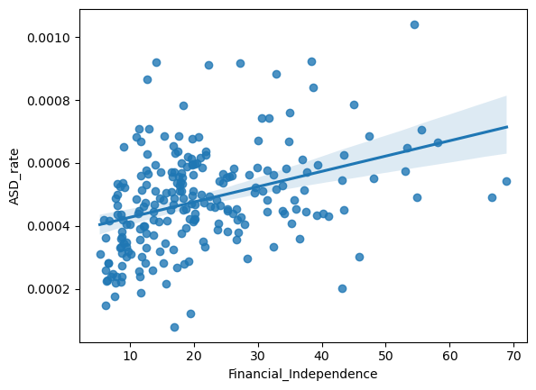

# ASD_ID_FI_Correlation
A Study on the Correlation between Neurodivergent of ASD Registration and Financial Independence

이 연구는 신경다양인의 자폐성 장애인 등록과 거주 지역의 재정자립도와의 관계를 연구하는 저장소입니다.

## Main Link
https://github.com/milkywaypeko/ASD_ID_FI_Correlation/blob/main/ASD_ID_FI_Correlation.ipynb

## Colab Link (Require Google login)
https://colab.research.google.com/github/milkywaypeko/ASD_ID_FI_Correlation/blob/main/ASD_ID_FI_Correlation_Google.ipynb

## Library requirements
|Library name|Version |
|------------|--------|
|Python      |3.11.3-1|
|JupyterLab  |3.6.3-7 |
|NumPy       |1.24.3-2|
|Pandas      |1.5.3-3 |
|Matplotlib  |3.7.1-4 |
|Seaborn     |0.12.2-3|
|Statsmodels |0.13.5-3|
|Scikit-learn|1.2.2-3 |

You can install it easily using [Anaconda](https://www.anaconda.com/).

### Install With Miniconda
Miniconda is lite version of [Anaconda](https://www.anaconda.com/).

[Download Miniconda Installer](https://docs.conda.io/en/latest/miniconda.html)

#### Install Command Line
> ```conda install anaconda-navigator jupyterlab numpy pandas matplotlib seaborn statsmodels scikit-learn```

> ```anaconda-navigator```

### Install in ArchLinux
> ```sudo pacman -S python jupyterlab python-numpy python-pandas python-matplotlib python-seaborn python-statsmodels python-scikit-learn```

## Word Description
### Data columns
|Korean   |Initial|English                                             |
|---------|-------|----------------------------------------------------|
|광역자치단체|RLG|Regional Local Government / Metropolitan government|
|기초자치단체|BLG|Basic local government / Municipality |
|지적장애   |ID|Intellectual disability|
|자폐성장애 |ASD|Autistic Spectrum Disorder|
|발달장애   |DD|Developmental Disability|
|인구     |N/A|Population|
|재정자립도|FI|Financial Independence|
|재정자주도|FO|Financial often|

### Other columns
|Korean   |Initial|English                                             |
|---------|-------|----------------------------------------------------|
|지체장애   |PD|Physical Disability|
|뇌병변장애 |BL|Disability of Brain Lesion |
|시각장애   |VD|Visual Disability|
|청각장애   |HD|Hearing Disability|
|언어장애   |LD|Language Disorder|
|정신장애   |MD|Mental Disorder|
|신장장애   |KD|Kidney Dysfunction|
|심장장애   |CD|Cardiac Dysfunction|
|호흡기장애 |RD|Respiratory Dysfunction|
|간 장애   |HDB|Hepatic Dysfunction|
|안면장애  |FD|Facial Disfigurement|
|장루요루장애|IUF|Intestinal/Urinary Fistula|
|뇌전증장애 |EP|Epilepsy|

## Results

### Simple Linear Regression of ASD_rate and Financial_Independence



|                           |coef      |std err |t      |P>&#124;t&#124;|[0.025   |0.975]   |
|---------------------------|----------|--------|-------|---------------|---------|---------|
|Intercept                  |0.0004    |1.95e-05|19.406 |<0.001         |0.000    |0.000    |
|Financial_Independence     |4.873e-06 |8e-07   |6.090  |<0.001         |3.3e-06  |6.45e-06 |

### Simple Linear Regression of Other_Disability_rate and Financial_Independence
|Financial_Independence    |coef      |std err |t      |P>&#124;t&#124;|[0.025   |0.975]   |
|--------------------------|----------|--------|-------|---------------|---------|---------|
|Physical Disability       |-0.0007   |5.1e-05 |-13.439|<0.001         |-0.001   |-0.001   |
|Disability of Brain Lesion|-8.965e-05|6.63e-06|-13.524|<0.001         |-0.000   |-7.66e-05|
|Visual Disability         |-0.0001   |1.24e-05|-10.627|<0.001         |-0.000   |-0.000   |
|Hearing Disability        |-0.0002   |2.98e-05|-6.878 |<0.001         |-0.000   |-0.000   |
|Language Disorder         |-2.94e-05 |8.77e-06|-3.354 |0.001          |-4.67e-05|-1.21e-05|
|Intellectual disability   |-0.0001   |1.08e-05|-11.569|<0.001         |-0.000   |-0.000   |
|Autistic Spectrum Disorder|4.873e-06 |8e-07   |6.090  |<0.001         |3.3e-06  |6.45e-06 |
|Mental Disorder           |-5.862e-05|5.91e-06|-9.924 |<0.001         |-7.03e-05|-4.7e-05 |
|Kidney Dysfunction        |-1.206e-05|1.94e-06|-6.208 |<0.001         |-1.59e-05|-8.23e-06|
|Cardiac Dysfunction       |-7.517e-07|2.92e-07|-2.574 |0.011          |-1.33e-06|-1.76e-07|
|Respiratory Dysfunction   |-4.748e-06|6.26e-07|-7.585 |<0.001         |-5.98e-06|-3.51e-06|
|Hepatic Dysfunction       |-2.542e-06|5.27e-07|-4.823 |<0.001         |-3.58e-06|-1.5e-06 |
|Facial Disfigurement      |-7.662e-07|1.8e-07 |-4.257 |<0.001         |-1.12e-06|-4.12e-07|
|Intestinal/Urinary Fistula|-6.797e-06|6.68e-07|-10.183|<0.001         |-8.11e-06|-5.48e-06|
|Epilepsy                  |-3.385e-06|4.09e-07|-8.285 |<0.001         |-4.19e-06|-2.58e-06|
|Developmental Disability  |-0.0001   |1.05e-05|-11.368|<0.001         |-0.000   |-9.89e-05|

## Data Source

|Region                                 |Time point(Year)|source|
|---------------------------------------|----------------|------|
|[Seoul](#Seoul)                        |2019            |서울특별시,「서울특별시기본통계」, 2020, 2023.04.20|
|[Busan](#Busan)                        |2020            |부산광역시,「부산광역시기본통계」, 2020, 2023.04.20|
|[Daegu](#Daegu)                        |2020            |대구광역시,「대구광역시기본통계」, 2020, 2023.04.20|
|[Incheon](#Incheon)                    |2016            |인천광역시,「인천광역시기본통계」, 2020, 2023.04.20|
|[Gwangju](#Gwangju)                    |2020            |광주광역시,「광주광역시기본통계」, 2021, 2023.04.20|
|[Daejeon](#Daejeon)                    |2020            |대전광역시,「대전광역시기본통계」, 2020, 2023.04.20|
|[Ulsan](#Ulsan)                        |2020            |울산광역시,「울산광역시기본통계」, 2020, 2023.04.20|
|[Sejong](#Sejong)                      |2019            |세종특별자치시,「세종특별자치시기본통계」, 2020, 2023.04.20|
|[Gyeonggi-do](#Gyeonggi-do)            |2019            |경기도,「경기도기본통계」, 2020, 2023.04.20|
|[Gangwon-do](#Gangwon-do)              |2020            |강원도,「강원도기본통계」, 2020, 2023.04.20|
|[Chungcheongbuk-do](#Chungcheongbuk-do)|2020            |충청북도,「충청북도기본통계」, 2020, 2023.04.20|
|[Chungcheongnam-do](#Chungcheongnam-do)|2020            |충청남도,「충청남도기본통계」, 2020, 2023.04.20|
|[Jeollabuk-do](#Jeollabuk-do)          |2019            |전라북도,「전라북도기본통계」, 2020, 2023.04.20|
|[Jeollanam-do](#Jeollanam-do)          |2019            |전라남도,「전라남도기본통계」, 2020, 2023.04.20|
|[Gyeongsangbuk-do](#Gyeongsangbuk-do)  |2020            |경상북도,「경상북도기본통계」, 2020, 2023.04.20|
|[Gyeongsangnam-do](#Gyeongsangnam-do)  |2020            |경상남도,「경상남도기본통계」, 2020, 2023.04.20|
|[Jeju](#Jeju)                          |2020            |제주특별자치도,「제주특별자치도기본통계」, 2020, 2023.04.20|

### Link
#### Seoul
|Data                  |Link|
|----------------------|----|
|Disability            |https://kosis.kr/statHtml/statHtml.do?orgId=201&tblId=DT_201_00018_2014&conn_path=I2|
|Population            |https://kosis.kr/statHtml/statHtml.do?orgId=201&tblId=DT_201_00419_1991&conn_path=I2|
|Financial Independence|https://kosis.kr/statHtml/statHtml.do?orgId=201&tblId=DT_201_00188_2009&conn_path=I2|
|Financial often       |https://kosis.kr/statHtml/statHtml.do?orgId=201&tblId=DT_201_10210_2005&conn_path=I2|

#### Busan
|Data                        |Link|
|----------------------------|----|
|Disability                  |https://kosis.kr/statHtml/statHtml.do?orgId=202&tblId=DT_1137&conn_path=I2|
|Population                  |https://kosis.kr/statHtml/statHtml.do?orgId=202&tblId=DT_202&conn_path=I2|
|Financial Independence/often|https://kosis.kr/statHtml/statHtml.do?orgId=202&tblId=DT_1419&conn_path=I2|

#### Daegu
|Data                        |Link|
|----------------------------|----|
|Disability                  |https://kosis.kr/statHtml/statHtml.do?orgId=203&tblId=DT_K2E001&conn_path=I2|
|Population                  |https://kosis.kr/statHtml/statHtml.do?orgId=203&tblId=DT_B40001&conn_path=I2|
|Financial Independence/often|https://kosis.kr/statHtml/statHtml.do?orgId=203&tblId=DT_N70001&conn_path=I2|

#### Incheon
|Data                        |Link|
|----------------------------|----|
|Disability                  |https://kosis.kr/statHtml/statHtml.do?orgId=204&tblId=DT_20402_K000042&conn_path=I2|
|Population                  |https://kosis.kr/statHtml/statHtml.do?orgId=204&tblId=DT_20402_B000016&conn_path=I2|
|Financial Independence/often|https://kosis.kr/statHtml/statHtml.do?orgId=204&tblId=DT_20402_N000007&conn_path=I2|

#### Gwangju
|Data                        |Link|
|----------------------------|----|
|Disability                  |https://kosis.kr/statHtml/statHtml.do?orgId=205&tblId=DT_20503_K001036&conn_path=I2|
|Population                  |https://kosis.kr/statHtml/statHtml.do?orgId=205&tblId=DT_20503_B001004&conn_path=I2|
|Financial Independence/often|https://kosis.kr/statHtml/statHtml.do?orgId=205&tblId=DT_20503_N001020&conn_path=I2|

#### Daejeon
|Data                        |Link|
|----------------------------|----|
|Disability                  |https://kosis.kr/statHtml/statHtml.do?orgId=206&tblId=DT_20603_K001036&conn_path=I2|
|Population                  |https://kosis.kr/statHtml/statHtml.do?orgId=206&tblId=DT_20603_B001004&conn_path=I2|
|Financial Independence/often|https://kosis.kr/statHtml/statHtml.do?orgId=206&tblId=DT_20603_N001020&conn_path=I2|

#### Ulsan
|Data                        |Link|
|----------------------------|----|
|Disability                  |https://kosis.kr/statHtml/statHtml.do?orgId=207&tblId=DT_2071K36&conn_path=I2|
|Population                  |https://kosis.kr/statHtml/statHtml.do?orgId=207&tblId=DT_2071B02&conn_path=I2|
|Financial Independence/often|https://kosis.kr/statHtml/statHtml.do?orgId=207&tblId=DT_2071O24&conn_path=I2|

#### Sejong
|Data                        |Link|
|----------------------------|----|
|Disability                  |https://kosis.kr/statHtml/statHtml.do?orgId=208&tblId=DT_20802N_200&conn_path=I2|
|Population                  |https://kosis.kr/statHtml/statHtml.do?orgId=208&tblId=DT_20802N_328&conn_path=I2|
|Financial Independence/often|https://kosis.kr/statHtml/statHtml.do?orgId=208&tblId=DT_20802N_259A&conn_path=I2|

#### Gyeonggi-do
|Data                        |Link|
|----------------------------|----|
|Disability                  |https://kosis.kr/statHtml/statHtml.do?orgId=210&tblId=DT_21002_K033&conn_path=I2|
|Population                  |https://kosis.kr/statHtml/statHtml.do?orgId=210&tblId=DT_21002B002&conn_path=I2|
|Financial Independence/often|https://kosis.kr/statHtml/statHtml.do?orgId=210&tblId=DT_21002_N015&conn_path=I2|

#### Gangwon-do
|Data                        |Link|
|----------------------------|----|
|Disability                  |https://kosis.kr/statHtml/statHtml.do?orgId=211&tblId=DT_211002_K030&conn_path=I2|
|Population                  |https://kosis.kr/statHtml/statHtml.do?orgId=211&tblId=DT_211002_B002&conn_path=I2|
|Financial Independence/often|https://kosis.kr/statHtml/statHtml.do?orgId=211&tblId=DT_211002_N015&conn_path=I2|

#### Chungcheongbuk-do
|Data                        |Link|
|----------------------------|----|
|Disability                  |https://kosis.kr/statHtml/statHtml.do?orgId=212&tblId=DT_T28&conn_path=I2|
|Population                  |https://kosis.kr/statHtml/statHtml.do?orgId=212&tblId=DT_B13&conn_path=I2|
|Financial Independence/often|https://kosis.kr/statHtml/statHtml.do?orgId=212&tblId=DT_Y34&conn_path=I2|

#### Chungcheongnam-do
|Data                        |Link|
|----------------------------|----|
|Disability                  |https://kosis.kr/statHtml/statHtml.do?orgId=213&tblId=DT_21303_K000086&conn_path=I2|
|Population                  |https://kosis.kr/statHtml/statHtml.do?orgId=213&tblId=DT_21303_B000033&conn_path=I2|
|Financial Independence/often|https://kosis.kr/statHtml/statHtml.do?orgId=213&tblId=DT_21303_N000041&conn_path=I2|

#### Jeollabuk-do
|Data                        |Link|
|----------------------------|----|
|Disability                  |https://kosis.kr/statHtml/statHtml.do?orgId=214&tblId=DT_214N_Z00026&conn_path=I2|
|Population                  |https://kosis.kr/statHtml/statHtml.do?orgId=214&tblId=DT_21402_B002&conn_path=I2|
|Financial Independence/often|https://kosis.kr/statHtml/statHtml.do?orgId=214&tblId=DT_21402_N000001&conn_path=I2|

#### Jeollanam-do
|Data                        |Link|
|----------------------------|----|
|Disability                  |https://kosis.kr/statHtml/statHtml.do?orgId=215&tblId=DT_K037&conn_path=I2|
|Population                  |https://kosis.kr/statHtml/statHtml.do?orgId=215&tblId=DT_B01&conn_path=I2|
|Financial Independence/often|https://kosis.kr/statHtml/statHtml.do?orgId=215&tblId=DT_21502_N001025&conn_path=I2|

#### Gyeongsangbuk-do
|Data                        |Link|
|----------------------------|----|
|Disability                  |https://kosis.kr/statHtml/statHtml.do?orgId=216&tblId=DT_21603_K001036&conn_path=I2|
|Population                  |https://kosis.kr/statHtml/statHtml.do?orgId=216&tblId=DT_21603_B001004&conn_path=I2|
|Financial Independence/often|https://kosis.kr/statHtml/statHtml.do?orgId=216&tblId=DT_21603_N001020&conn_path=I2|

#### Gyeongsangnam-do
|Data                        |Link|
|----------------------------|----|
|Disability                  |https://kosis.kr/statHtml/statHtml.do?orgId=217&tblId=DT_217003N_K036&conn_path=I2|
|Population                  |https://kosis.kr/statHtml/statHtml.do?orgId=217&tblId=DT_217003N_B003&conn_path=I2|
|Financial Independence/often|https://kosis.kr/statHtml/statHtml.do?orgId=217&tblId=DT_217003N_N016&conn_path=I2|

#### Jeju
|Data                        |Link|
|----------------------------|----|
|Disability                  |https://kosis.kr/statHtml/statHtml.do?orgId=218&tblId=DT_21802_K001036&conn_path=I2|
|Population                  |https://kosis.kr/statHtml/statHtml.do?orgId=218&tblId=DT_21802_B001005&conn_path=I2|
|Financial Independence/often|https://kosis.kr/statHtml/statHtml.do?orgId=218&tblId=DT_21802_N001020&conn_path=I2|
